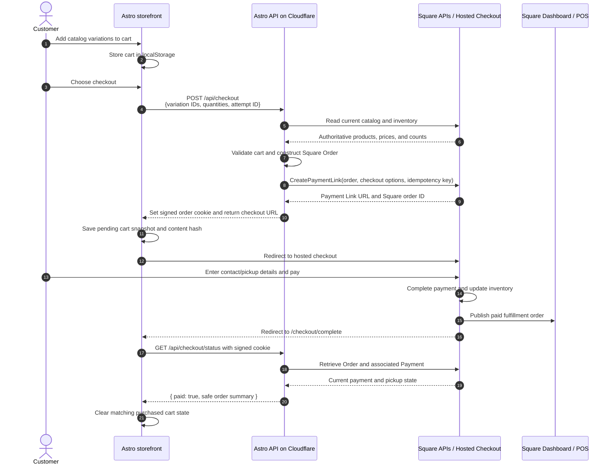

# Backend Architecture: Square Ecommerce

Status: Accepted  
Last updated: 2026-09-20

## Summary

Beam's Astro site will be the only storefront. Square will remain the system of
record for products, prices, inventory, payments, orders, receipts, and
fulfillment.

Checkout will use Square's hosted Checkout API (`CreatePaymentLink`). Customers
will browse and build their cart on the Beam site, leave briefly to pay on a
Square-hosted page, and then return to the Beam site.

The Astro backend will be a stateless, server-side proxy to Square. The initial
implementation will not require an application database or Square webhooks.

## Goals

- Keep the Beam site as the only storefront.
- Manage products, variations, prices, and inventory in Square.
- Use Square-hosted checkout instead of embedding payment fields in Astro.
- Manage paid pickup orders and fulfillment in Square Dashboard and Square POS.
- Keep the Astro backend stateless and avoid maintaining a second order system.
- Preserve a simple, mobile-first cart and checkout experience.

## Non-goals

- Customer accounts or login.
- Cross-device carts or order history on the Beam site.
- A Beam-owned order-management system.
- Custom payment forms or direct card tokenization.
- Custom fulfillment notifications in the initial release.
- Shipping or delivery in the initial release.
- A parallel Square Online storefront.

## Responsibilities

### Square

Square is authoritative for:

- Catalog items and variations, including size and color.
- Prices, discounts, and taxable status.
- Inventory counts at the salon's Square location.
- Hosted checkout and payment processing.
- Payment receipts.
- Orders and their payment records.
- Pickup fulfillment state.
- Refunds.
- Staff order-management workflows in Square Dashboard and Square POS.

Paid orders must include a fulfillment so they appear in Square's order manager.
Each API-created order will have one `PICKUP` fulfillment at the salon.

### Astro and Cloudflare

Astro server endpoints will:

- Read catalog and inventory data from Square.
- Return a storefront-safe product representation to the browser.
- Validate cart items, quantities, prices, and availability at checkout.
- Create a new Square Payment Link containing a complete Square Order.
- Optionally retrieve the resulting Order and Payment for the confirmation page.
- Keep the Square access token and other secrets out of browser code.

The existing Astro Cloudflare adapter provides the required server runtime.
Most of the website can remain prerendered; only ecommerce API routes need to
run on demand.

### Browser

The browser will own only temporary presentation state:

- The current cart in `localStorage`.
- A pending-checkout snapshot and deterministic cart-content hash.
- UI state such as drawers, selected variations, and loading messages.

Browser state is never authoritative for price, inventory, tax, discounts, or
payment status.

## Checkout flow



## Proposed API surface

### `GET /api/products`

Returns a storefront-safe projection of Square Catalog and Inventory data:

```json
{
  "products": [
    {
      "id": "SQUARE_ITEM_ID",
      "name": "B HAT",
      "images": [
        {
          "id": "SQUARE_IMAGE_ID",
          "url": "https://...",
          "alt": "Model wearing the B Hat"
        }
      ],
      "optionGroups": [
        {
          "id": "SQUARE_OPTION_ID",
          "name": "Size",
          "values": [
            { "id": "SMALL_VALUE_ID", "name": "Small" },
            { "id": "LARGE_VALUE_ID", "name": "Large" }
          ]
        }
      ],
      "defaultVariationId": "SMALL_VARIATION_ID",
      "variations": [
        {
          "id": "SMALL_VARIATION_ID",
          "name": "Small",
          "optionValues": [
            {
              "optionId": "SQUARE_OPTION_ID",
              "valueId": "SMALL_VALUE_ID"
            }
          ],
          "price": {
            "amount": 3500,
            "currency": "USD"
          },
          "available": true,
          "availableQuantity": 4,
          "imageIds": ["SQUARE_IMAGE_ID"]
        }
      ]
    }
  ]
}
```

The endpoint will:

1. Return non-archived `REGULAR` items in the configured shop category that are
   enabled at the salon location.
2. Return only enabled, sellable, fixed-price, inventory-tracked variations,
   while retaining sold-out variations so the UI can disable them.
3. Resolve location-specific prices and inventory settings. Money amounts use
   integer minor units. `availableQuantity` is the non-negative whole-unit
   `IN_STOCK` count, and `available` is false when that count is zero or Square
   marks the variation sold out.
4. Represent size, color, and future variation dimensions through
   `optionGroups` and `optionValues`. Products with one unconfigured variation
   may return an empty `optionGroups` array.
5. Return the ordered, deduplicated union of item and variation images. Image
   captions become alt text, falling back to the product name; `imageIds`
   associates variation-specific images with a selection.
6. Consume Square pagination internally and return one unpaginated product
   list. Items with no eligible variations are omitted; an empty shop returns
   `200` with `{ "products": [] }`.

Products use Square item and variation IDs. `defaultVariationId` is the first
available variation by Square ordinal, falling back to the first variation.
Product order follows the Square catalog search order, and variation order
follows Square ordinal.

The response may be cached briefly at the edge, for example with
`Cache-Control: public, max-age=0, s-maxage=60, stale-while-revalidate=300`.
Incomplete Square responses fail the whole request with a generic `502` rather
than returning partial product data. Checkout must always revalidate catalog,
price, and inventory data instead of trusting this response.

### `POST /api/checkout`

Accepts:

```json
{
  "attemptId": "browser-generated-uuid",
  "items": [
    {
      "variationId": "SQUARE_VARIATION_ID",
      "quantity": 2
    }
  ]
}
```

The endpoint will:

1. Validate input shape and quantity limits.
2. Retrieve authoritative Square variations, prices, and inventory.
3. Reject missing, unavailable, or insufficient-stock items.
4. Build a Square Order using Catalog variation IDs.
5. Add a `PICKUP` fulfillment for the salon location.
6. Apply the salon location's configured catalog tax.
7. Call `CreatePaymentLink` using `attemptId` as, or as input to, the Square
   idempotency key.
8. Set a short-lived signed, HTTP-only cookie containing the returned Square
   order ID and expiry.
9. Return only the Square-hosted checkout URL to the browser.

A new Payment Link is created for each checkout attempt. The browser must retain
the same `attemptId` when retrying the same request so Square can prevent
accidental duplicate creation.

### `GET /api/checkout/status`

This optional endpoint powers Beam's confirmation page without a database.

It will:

1. Verify and decode the signed checkout cookie.
2. Retrieve the Square Order by ID.
3. Read the Order's `tenders` and retrieve their associated Payments.
4. Confirm that a Payment is `COMPLETED` and belongs to the expected location
   and Order.
5. Return only a minimal, non-sensitive order summary.

The cart is cleared based on completed payment, not `order.state`. An order with
an unfulfilled pickup can remain `OPEN` after it has been paid.

## Cart clearing and interrupted returns

The cart must not be cleared when the customer clicks Checkout. At that point,
the customer might still abandon checkout or have their payment declined.

Before redirecting, the browser records:

```json
{
  "attemptId": "browser-generated-uuid",
  "cartHash": "SHA-256_OF_CANONICAL_CART_CONTENTS",
  "items": [
    {
      "variationId": "SQUARE_VARIATION_ID",
      "quantity": 2
    }
  ]
}
```

The cart hash is computed from a canonical representation of cart contents:
sort items by variation ID, normalize quantities, serialize the resulting list,
and hash it with SHA-256. Display order and unrelated UI state must not affect
the hash.

After Square redirects to `/checkout/complete`, the browser calls
`/api/checkout/status`. When the backend confirms a `COMPLETED` payment:

- Recompute the current cart hash.
- Clear the full cart only if its hash matches the purchased cart's hash.
- If the hash differs, leave the current cart completely untouched. It represents
  a different cart assembled before or during checkout.
- Remove the pending-checkout record.

If the customer pays but closes the tab before returning, the next storefront
load can detect the pending checkout and query `/api/checkout/status` again.
If browser storage or cookies were cleared, the Beam site cannot reconcile that
browser's cart, but the Square order remains valid and unaffected.

## No database

No persistent application database is planned initially.

The signed cookie provides stateless authorization for checking one Square
order. It should contain only the order ID and expiry, and use attributes similar
to:

```text
HttpOnly; Secure; SameSite=Lax; Path=/; Max-Age=<short lifetime>
```

Square remains the durable store. The design intentionally does not provide:

- Cross-device checkout recovery.
- Customer order history on the Beam site.
- Internal ecommerce reporting outside Square.
- Custom automated actions after payment.

These features would justify adding persistent storage later.

## No webhook initially

Square does not require Beam to receive a webhook in order to:

- Complete payment.
- Create or update the order.
- Adjust tracked inventory.
- Show the paid fulfillment order in Square Dashboard.
- Let staff manage pickup.

Because Beam will not maintain a second order database or trigger custom
post-payment actions, there is initially nothing for a webhook to synchronize.

Add webhooks later if Beam needs to:

- Send custom emails or staff notifications.
- Maintain customer order history.
- Push orders to another system.
- Invalidate product caches immediately.
- Record server-side ecommerce analytics.
- React to refunds or fulfillment changes outside Square.

## Fulfillment

The initial release supports in-store pickup only. Every order will contain a
single `PICKUP` fulfillment for the salon location.

- Create the order with a `PICKUP` fulfillment.
- Square collects or receives the recipient contact information.
- Staff handles the order in Square Dashboard or Square POS.
- No shipping address or shipping charge is collected.
- Shipping and delivery are deferred to a future architecture decision.

## Tax

The initial release will use the salon location's taxes configured in the Square
Catalog. Before launch, confirm the configured rates and the taxable status of
each merchandise and product category with the business's tax adviser.

Destination-based tax is not needed while all orders are picked up at the salon.
Adding shipping later will reopen the tax architecture decision because
API-created Payment Link orders do not receive Square Online's automatic
destination-based tax calculation.

## Customer communications

Square-hosted checkout provides a confirmation and payment-receipt experience.
Paid pickup orders can be managed in Square through their fulfillment lifecycle.

Do not assume that every Square Online email or SMS workflow applies to
API-created Payment Link orders. Before launch, run a low-value production order
and verify:

- The buyer's checkout confirmation and receipt email.
- The notification received by salon staff.
- The buyer experience when an order is marked ready for pickup.
- The refund communication flow.

If Square's communications are insufficient, custom notifications would require
a webhook and an idempotent delivery mechanism, and might justify persistent
storage.

## Security and abuse controls

- Keep `SQUARE_ACCESS_TOKEN` server-only in Cloudflare secrets.
- Never accept browser-supplied prices, discounts, taxes, or payment state.
- Revalidate every cart against Square immediately before creating checkout.
- Sign the order cookie with a dedicated secret and give it a short expiry.
- Return minimal order data from `/api/checkout/status`; do not expose customer
  PII unnecessarily.
- Use Square idempotency keys for every Payment Link creation attempt.
- Apply Cloudflare rate limiting or bot protection to `/api/checkout` to prevent
  automated creation of abandoned links and draft orders.
- Do not put addresses, emails, phone numbers, access tokens, or payment details
  in `localStorage`.

## Environment configuration

Expected server-side configuration:

```text
SQUARE_ENVIRONMENT=sandbox|production
SQUARE_ACCESS_TOKEN=...
SQUARE_LOCATION_ID=...
SQUARE_COOKIE_SECRET=...
PUBLIC_SITE_URL=https://...
```

Production and Sandbox use different credentials, locations, catalog IDs,
inventory, and orders. Product variation IDs must be discovered from Square and
must not be hardcoded into Astro components.

## Local development

- Run Astro with `npm run dev`.
- Use a Square Sandbox seller account and Sandbox catalog.
- Point the Square SDK at the Sandbox environment.
- Use Square's Sandbox Payment Link testing flow for end-to-end checkout tests.
- Use an HTTPS tunnel or deployed preview when a public return URL is needed.
- Verify created orders and payments through the Sandbox Square Dashboard and
  API Explorer.

The Sandbox hosted-checkout UI is not identical to production and supports fewer
payment methods. Before launch, perform a low-value production purchase and
refund to validate the complete customer and staff experience.

## Future triggers for revisiting this decision

Revisit the stateless design if Beam adds:

- Customer accounts or order history.
- Cross-device carts.
- Shipping or delivery.
- Multiple sales channels outside Square.
- Custom transactional emails.
- Advanced analytics or attribution.
- Automated shipping-label creation.
- A third-party tax engine that requires transaction reconciliation.
- External inventory or fulfillment systems.

## References

- [Square Checkout API](https://developer.squareup.com/docs/checkout-api)
- [Square order checkout](https://developer.squareup.com/docs/checkout-api/square-order-checkout)
- [Square checkout options](https://developer.squareup.com/docs/checkout-api/optional-checkout-configurations)
- [Square Catalog API](https://developer.squareup.com/docs/catalog-api/what-it-does)
- [Square Inventory API](https://developer.squareup.com/docs/inventory-api/what-it-does)
- [Square Orders API](https://developer.squareup.com/docs/orders-api/what-it-does)
- [Retrieve Square orders and payments](https://developer.squareup.com/docs/orders-api/manage-orders/retrieve-orders)
- [Manage Square fulfillments](https://developer.squareup.com/docs/orders-api/fulfillments)
- [Square API idempotency](https://developer.squareup.com/docs/build-basics/common-api-patterns/idempotency)
- [Astro on-demand rendering](https://docs.astro.build/en/guides/on-demand-rendering/)
